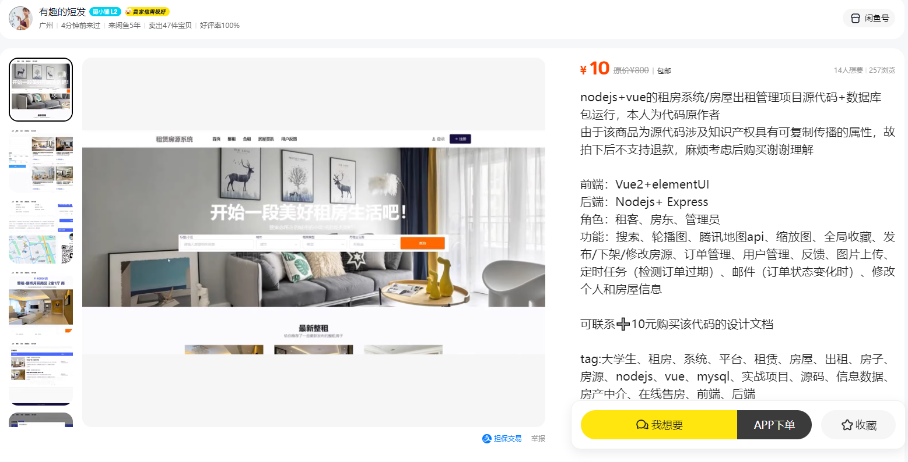

如需数据库可闲鱼（10）[闲鱼链接](https://www.goofish.com/item?id=798870562481&spm=widle.12011849.Weixin.detail&ut_sk=1.ZEKcXKRsasoDAI2On9uxajZP_12431167_1728823042027.Weixin.detail.798870562481.2490230821)

演示视频：[B站视频](https://www.bilibili.com/video/BV16f421R7uL/?spm_id_from=333.1007.top_right_bar_window_history.content.click)



- 前端：Vue2+elementUI
- 后端：Nodejs+ Express
- 角色：租客、房东、管理员
- 功能：搜索、轮播图、腾讯地图api、缩放图、全局收藏、筛选房源、反馈、图片上传、定时任务（检测订单过期）、邮件（订单状态变化时）、修改个人和房屋信息


注意：需要修改public/index.html中腾讯地图的key，改为自己的

## Project setup
```
npm install
```

### Compiles and hot-reloads for development
```
npm run serve
```

### Compiles and minifies for production
```
npm run build
```

### Customize configuration
See [Configuration Reference](https://cli.vuejs.org/config/).

.jpg)
.jpg)
.jpg)
.jpg)
.jpg)
.jpg)
.jpg)
.jpg)
.jpg)
.jpg)